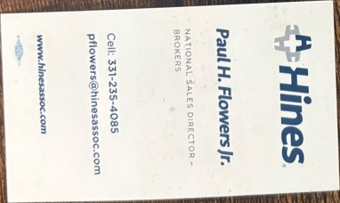

# Hines (Hines & Associates / brokerage channel)

**Card title:** Paul H. Flowers Jr.
**Role:** National Sales Director — Brokers
**Contact on card:** Cell 331-235-4085 · pflowers@hinesassoc.com ·
www.hinesassoc.com

## What I was hired to do

Sell into the broker channel — get brokers to recommend the firm's
services to their employer clients. National territory, broker-facing,
not employer-facing.

## What the role gave me access to

- The mechanics of the broker channel as a distribution layer:
  who pays whom, who chooses what, and on whose behalf.
- How "independent" brokers are positioned to employers vs. how they
  are actually compensated.
- The contrast between what's pitched in a broker meeting and what
  ends up in the employer's contract.

## What I will and won't write about

- Will: channel economics, conflict-of-interest patterns that are
  documented in public disclosures and DOL filings.
- Won't: specific broker partners, named relationships, anything
  covered by my employment agreements.
